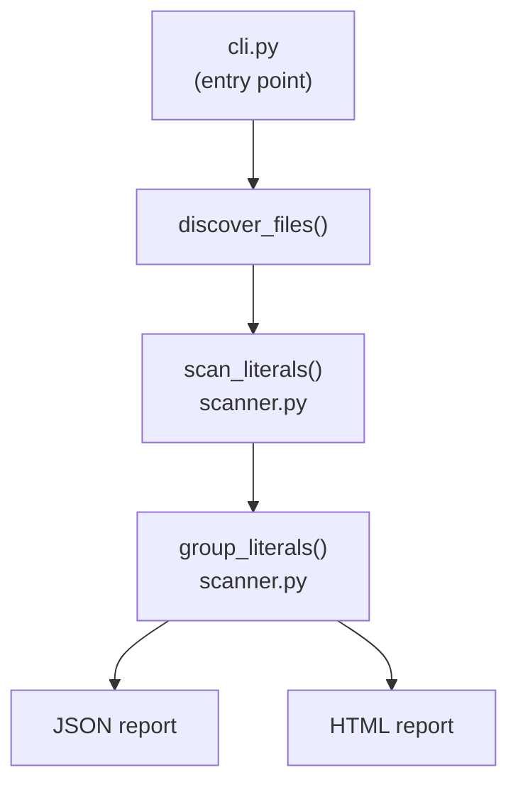

# litscan 1.0.0

> A small CLI tool that scans a codebase for string and numeric literals, helping you quickly spot hard-coded values in source files.

## Prerequisites

- Python 3.14+
- Poetry 2.2+

## Installation

```powershell
poetry install
```

## Usage

After installation, litscan is available as a console script:

```powershell
poetry run litscan <path> [options]
```

Or directly via the module:

```powershell
poetry run python -m litscan.cli <path> [options]
```

### Arguments

| Argument | Description |
|----------|-------------|
| `path`   | Target directory or file to scan |

### Options

| Option | Default | Description |
|--------|---------|-------------|
| `--ext <exts>` | _(all files)_ | Comma-separated extensions to include (e.g. `py,js,ts`) |
| `--output <name>` | `litscan-output` | Base name (without extension) for output file(s) |
| `--output-dir <dir>` | `reports` | Directory where output file(s) will be written |
| `--format <fmt>` | `json` | Output format: `json`, `html`, or `all` |

### Examples

Scan all files in the current directory and produce a JSON report:

```powershell
poetry run litscan .
```

Scan only Python and JavaScript files in `src/`:

```powershell
poetry run litscan src --ext py,js
```

Generate both JSON and HTML reports in a custom directory:

```powershell
poetry run litscan . --format all --output-dir my-reports
```

Scan a Java source tree with a custom output name:

```powershell
poetry run litscan src/main/java --ext java --format all --output-dir reports
```

## Architecture



## Development

### Test with coverage

```powershell
poetry run pytest --cov=litscan tests --cov-report html
```

### Format and lint

```powershell
poetry run black litscan; poetry run pylint litscan
```

## [Changelog](CHANGELOG.md)

## Author

Ron Webb &lt;ron@ronella.xyz&gt;
