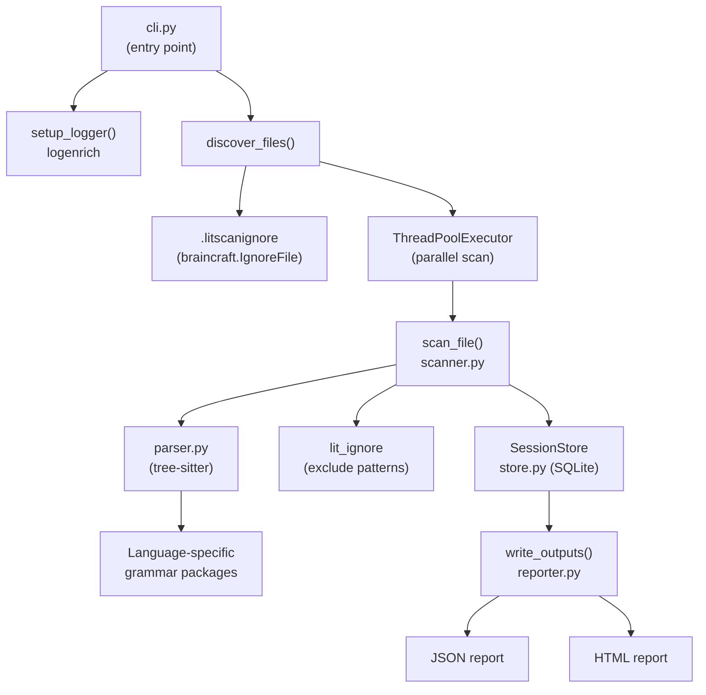

# litscan 2.1.0

> A small CLI tool that scans a codebase for string and numeric literals, helping you quickly spot hard-coded values in source files.

## Prerequisites

- Python 3.14+

## Installation

```powershell
pip install litscan
```

## Usage

After installation, litscan is available as a console script:

```powershell
litscan <path> [options]
```

### What is detected

The scanner uses tree-sitter to parse each file and extracts literal nodes per language:

| Language | Extensions | Literal types detected |
|----------|------------|------------------------|
| Python | `.py` `.pyi` | strings, integers, floats |
| JavaScript | `.js` `.mjs` `.cjs` | strings, numbers, template strings |
| TypeScript | `.ts` `.tsx` | strings, numbers, template strings |
| Java | `.java` | string literals, text blocks, integer literals, floating-point literals |
| Go | `.go` | interpreted strings, raw strings, integer literals, float literals |
| Gosu | `.gs` `.gsx` | string literals, integer literals, floating-point literals |
| C | `.c` `.h` | string literals, number literals, char literals |
| C++ | `.cpp` `.cc` `.cxx` `.hpp` `.hxx` | string literals, number literals, char literals |
| C# | `.cs` | string literals, integer literals, real literals |
| Rust | `.rs` | string literals, integer literals, float literals |
| Kotlin | `.kt` `.kts` | string literals, number literals, float literals |
| Swift | `.swift` | string literals, integer literals, real literals |
| Scala | `.scala` | strings, integer literals, floating-point literals |
| Groovy | `.groovy` `.gradle` | string literals, integer literals, floating-point literals |

Files with extensions not in the table above are skipped with a warning.

Results are grouped by unique literal value and sorted by occurrence count (highest first).

### Arguments

| Argument | Description |
|----------|-------------|
| `path`   | Target directory or file to scan. Multiple paths can be specified, separated by a semicolon (e.g. `src;lib;tests`). |

### Options

| Option | Default | Description |
|--------|---------|-------------|
| `--ext <exts>` | _(all files)_ | Comma-separated extensions to include (e.g. `py,js,ts`) |
| `--output <name>` | `litscan-output` | Base name (without extension) for output file(s) |
| `--output-dir <dir>` | `reports` | Directory where output file(s) will be written |
| `--format <fmt>` | `json` | Output format: `json`, `html`, or `all` |
| `--workers <n>` | `min(32, cpu_count + 4)` | Number of parallel worker threads used during scanning |
| `--db <path>` | `<system-temp>/litscan.db` | Path to the SQLite scratch database that stores occurrences during a scan run. Session records are removed after the report is written. |
| `--functions-only` | _(off)_ | Scan only literals that appear inside function or method implementations. Supported languages: Python, JavaScript, TypeScript, Java, Go, Gosu, C, C++, C#, Rust, Kotlin, Swift, Scala, Groovy. |
| `--min <count>` | `0` | Minimum occurrence count a literal must have to be included in the report. `0` means no filtering. |
| `--mode <mode>` | `both` | Literal category to scan: `string`, `number`, or `both`. |
| `--literals <values>` | _(all)_ | Semicolon-separated target literal values to restrict the report to (e.g. `foo;bar`). Matched against the decoded, single-line literal value; multi-line literals are never matched. |
| `--version` | | Print the version and exit. |

### Examples

Scan all files in the current directory and produce a JSON report:

```powershell
litscan .
```

Scan only Python and JavaScript files in `src/`:

```powershell
litscan src --ext py,js
```

Generate both JSON and HTML reports in a custom directory:

```powershell
litscan . --format all --output-dir my-reports
```

Scan a Java source tree with a custom output name:

```powershell
litscan src/main/java --ext java --format all --output-dir reports
```

Scan only literals inside functions and methods:

```powershell
litscan src --functions-only
```

Only report string literals that occur at least 3 times:

```powershell
litscan src --mode string --min 3
```

Restrict the report to specific target literal values:

```powershell
litscan src --literals "TODO;FIXME"
```

## Configuration

| Environment variable | Description |
|----------------------|-------------|
| `LITSCAN_CONFIG_DIR` | Directory where `logging.ini`, `lit_ignore`, and `.litscanignore` are seeded on first run and read from. When unset, the bundled copies inside the package are used directly. |

### Ignore patterns

The `lit_ignore` file (seeded into `LITSCAN_CONFIG_DIR` on first run) contains one regex pattern per line. Any literal whose value matches a pattern is excluded from scan results. Edit the file to suppress noise such as common stop-words or numeric constants you do not care about.

### Ignored files and directories

The `.litscanignore` file (also seeded into `LITSCAN_CONFIG_DIR` on first run) uses gitignore syntax to exclude entire files or directories from being scanned in the first place — matching directories are pruned during traversal, so their contents are never read. It ships with sensible defaults (`.git/`, `node_modules/`, `dist/`, `build/`, `__pycache__/`, `.venv/`); edit the file to add project-specific paths to skip.

### Report metadata

Every JSON/HTML report records the run's inputs alongside the findings: the resolved `--path` entries (`paths-scanned`), the `--min` threshold (`min-count`), the `--mode` used, and any `--literals` targets applied.

## Development

### Prerequisites

- Poetry 2.2+

### Installation

```powershell
poetry install
```

### Architecture



| Module | Responsibility |
|--------|---------------|
| `cli.py` | Argument parsing, file discovery, orchestration |
| `parser.py` | Tree-sitter language loading (LRU-cached) and source parsing |
| `scanner.py` | AST-based literal extraction; `LiteralOccurrence` / `LiteralGroup` types |
| `store.py` | `SessionStore` — thread-safe SQLite scratch store; one UUID per scan run |
| `reporter.py` | `write_outputs()` — renders JSON and/or HTML reports |
| `logenrich` | External library that provides `setup_logger()` — logging config seeded from `logging.ini` |

### Test with coverage

```powershell
poetry run pytest --cov=litscan tests --cov-report html
```

### Format and lint

```powershell
poetry run black litscan; poetry run pylint litscan
```

### Quality gates

- Coverage ≥ 90%
- Pylint score 10/10

### Example

Scan the test fixtures and produce both JSON and HTML reports:

```powershell
poetry run litscan tests\fixtures --format all
```

## Publishing to PyPI

### Prerequisites

- A [PyPI](https://pypi.org/) account with an API token.

### Configure the token

```bash
poetry config pypi-token.pypi <your-token>
```

### Build and publish

```bash
poetry publish --build
```

This builds the source distribution and wheel, then uploads them to PyPI in one step.

> **Note:** PyPI releases are immutable. Once a version is published, it cannot be overwritten.  
> To fix a mistake, yank the release via the PyPI web UI and publish a new version.

## [Changelog](CHANGELOG.md)

## License

[MIT](LICENSE)

## Author

Ron Webb &lt;ron@ronella.xyz&gt;
