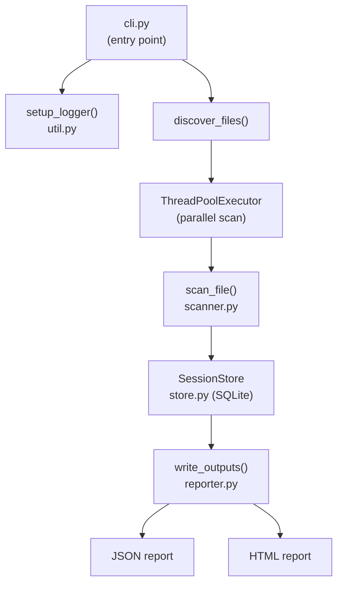

# litscan 1.0.0

> A small CLI tool that scans a codebase for string and numeric literals, helping you quickly spot hard-coded values in source files.

## Prerequisites

- Python 3.14+

## Installation

```powershell
pip install litscan
```

## Usage

After installation, litscan is available as a console script:

```powershell
litscan <path> [options]
```

### What is detected

The scanner recognises the following literal types in any source file:

| Type | Examples |
|------|---------|
| Triple-quoted strings (multiline) | `"""hello"""`, `'''world'''` |
| Double-quoted strings | `"hello"` |
| Single-quoted strings | `'world'` |
| Decimal numbers | `3.14`, `0.5` |
| Integer numbers | `42`, `0` |

Results are grouped by unique literal value and sorted by occurrence count (highest first).

### Arguments

| Argument | Description |
|----------|-------------|
| `path`   | Target directory or file to scan. Multiple paths can be specified, separated by a semicolon (e.g. `src;lib;tests`). |

### Options

| Option | Default | Description |
|--------|---------|-------------|
| `--ext <exts>` | _(all files)_ | Comma-separated extensions to include (e.g. `py,js,ts`) |
| `--output <name>` | `litscan-output` | Base name (without extension) for output file(s) |
| `--output-dir <dir>` | `reports` | Directory where output file(s) will be written |
| `--format <fmt>` | `json` | Output format: `json`, `html`, or `all` |
| `--workers <n>` | `min(32, cpu_count + 4)` | Number of parallel worker threads used during scanning |
| `--db <path>` | `<system-temp>/litscan.db` | Path to the SQLite scratch database that stores occurrences during a scan run. Session records are removed after the report is written. |

### Examples

Scan all files in the current directory and produce a JSON report:

```powershell
litscan .
```

Scan only Python and JavaScript files in `src/`:

```powershell
litscan src --ext py,js
```

Generate both JSON and HTML reports in a custom directory:

```powershell
litscan . --format all --output-dir my-reports
```

Scan a Java source tree with a custom output name:

```powershell
litscan src/main/java --ext java --format all --output-dir reports
```

## Configuration

| Environment variable | Description |
|----------------------|-------------|
| `LITSCAN_CONFIG_DIR` | Directory where `logging.ini` is seeded and read from. When unset, the bundled `logging.ini` inside the package is used directly. |

## Development

### Prerequisites

- Poetry 2.2+

### Installation

```powershell
poetry install
```

### Architecture



| Module | Responsibility |
|--------|---------------|
| `cli.py` | Argument parsing, file discovery, orchestration |
| `scanner.py` | Regex-based literal extraction; `LiteralOccurrence` / `LiteralGroup` types |
| `store.py` | `SessionStore` — thread-safe SQLite scratch store; one UUID per scan run |
| `reporter.py` | `write_outputs()` — renders JSON and/or HTML reports |
| `util.py` | `setup_logger()` — logging config seeded from `logging.ini` |

### Test with coverage

```powershell
poetry run pytest --cov=litscan tests --cov-report html
```

### Format and lint

```powershell
poetry run black litscan; poetry run pylint litscan
```

### Quality gates

- Coverage ≥ 80%
- Pylint score 10/10

## [Changelog](CHANGELOG.md)

## Author

Ron Webb &lt;ron@ronella.xyz&gt;
